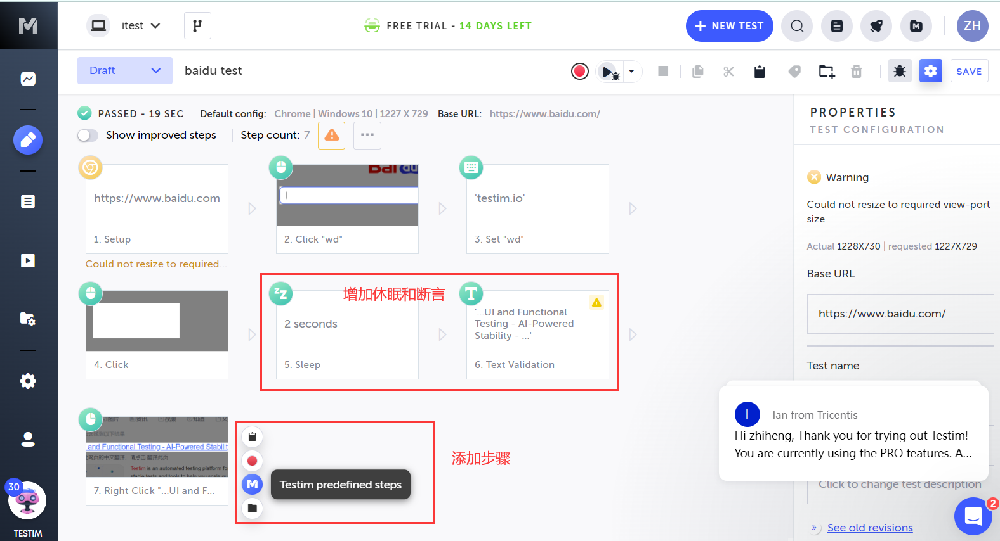

## Testim - AI 加持的自动化测试平台

Testim.io 提供了一个基于AI的自动化测试平台，专注于Web和移动应用的端到端测试。这个平台包括一系列的工具和服务，旨在简化测试过程，提高测试的效率和可靠性。下面是Testim.io平台提供的具体功能和工具：

1. **AI-Powered Test Case Generation**
   - Testim.io使用AI来创建稳定且易于维护的测试案例。通过智能分析应用程序的界面和行为，它能够自动记录测试步骤，生成测试脚本。

2. **Smart Element Locators**
   - Testim.io的AI引擎可以智能地识别和定位用户界面元素，即使这些元素的属性发生改变，也能保持测试的稳定性和准确性。

3. **Self-healing Tests**
   - 当应用程序的UI发生变化时，Testim.io的测试会自动进行调整，减少因UI变动而导致的测试维护工作。

### 注册平台账号

__1.注册账号__

https://app.testim.io/#/signup

> 注：必须使用企业邮箱& VPN 访问。

__2.安装插件__

可以看到 Applitools Eyes! 提供了不同应用类型的，以及编程语言和测试库的支持。


> 注：仅支持Chrome安装插件。


### 创建测试脚本

__1.创建自动化测试__

点击浏览器插件`Testim Editor`，选择 `CREATE AUTOMATED TEST` 选项。


__2.录制自动化测试__

此时， `Testim Editor` 处于录制状态，接下来，我们可以在百度页面上完成简单的输入和点击操作。


整个操作过程，Testim 会通过`Testim Editor` 插件记录，并上传到 Testim 平台。

> 过程中文字描述有些苍白，如果使用过 Selenium IDE 浏览器插件，整个过程非常类似。

__3.查看录制的脚本__

切回到 Testim 平台，将会看到录制的过程截图，工具一栏有个`recording` 按钮，如果整个过程操作结束，点击停止录制。


__4.编辑录制的脚本__

testim 平台提供了，用例的编辑能力：

* 可以选择新曾用例步骤，或者重新开启录制功能，继续录制步骤。

* 用例的步骤可以调整，之需拖动用例步骤即可。




### 运行/回放测试

点击 `Run test (F5)` 按钮可以运行测试。


运行的过程重新打开一个浏览器窗口，然后，跑自动化测试，执行完成，会弹窗提示运行完成。


> 当体验到这里的时候，我是略微有些失望，这和 Selenium IDE操作上非常类似，这样的录制回放工具十几年前就已经出现。

---

### Testim.io的 AI 能力

尽管录制和回放是 Testim.io 主要特性，但Testim.io 在 AI 和机器学习方面也融入了一些智能化能力，提升了其在自动化测试中的效率和可靠性。以下是 Testim.io AI 能力的一些体现：

__1. 智能元素定位（Smart Element Locator）__

Testim.io 使用 AI 和机器学习技术来增强元素定位的可靠性。传统的元素定位方法（如XPath或CSS选择器）在页面结构变化时容易失效，而 Testim.io 通过以下方式解决了这一问题：

- **动态选择器**：利用多种属性（如标签、类名、唯一ID、文本内容等）综合识别页面元素，而不仅仅是依赖单一的选择器。
- **稳定性评分**：为每个元素分配一个稳定性评分，衡量其在页面变化中的可靠程度。AI 模型会不断学习和调整，选择最稳定的元素定位策略。
- **自愈功能（Self-healing）**：在页面结构变化后，Testim.io 可以自动识别并调整失效的选择器，使测试用例保持稳定。

__2. 流程智能化（Smart Test Flow）__

Testim.io 提供了一些智能化的辅助功能来优化测试流程：

- **测试建议（Test Suggestions）**：基于AI对测试用例的分析，为用户提供改进建议，帮助提升测试覆盖率和效率。
- **参数化和数据驱动**：支持参数化测试用例，AI可以帮助识别和生成更适合不同输入条件的测试数据。

__3. 测试维护和优化__

维护自动化测试用例通常是一项复杂且耗时的工作，Testim.io 的 AI 能力在这方面给予了极大帮助：

- **变更检测和自动修复**：AI可以检测到应用程序中的UI变化并建议相应的测试用例调整，自动修复已知问题。
- **重复检测和优化**：分析测试用例，识别和消除冗余的测试步骤，优化测试流程，提高测试运行效率。

__4. 智能报表与分析__

Testim.io 还在测试结果的分析和报告生成方面利用了AI技术：

- **智能失败分析**：AI帮助识别测试失败的根本原因，提供详细的失败诊断信息，帮助开发和测试人员快速定位和修复问题。
- **趋势分析**：分析历史测试数据，提供趋势报告和关键指标，帮助团队了解应用程序的质量变化和测试进展。

### 验证AI 元素定位的能力

通过上面的描述，testim.io 在多个方面都提供了AI能力，这里就拿一个元素定位这一点来验证AI能力。

首先，我自己本地启动了就一个Web系统，这样方便我自己修改页面。

__1. 启动Web项目__

本地启动一个Web项目，页面是长这个样子的。


* 前端代码

```html
<input type="text" class="n-input__input-el" placeholder="请输入帐号" size="20">
<input type="password" class="n-input__input-el" placeholder="请输入密码" size="20">
```

前端代码查看登录并没有明显的`ID`、`name` 属性。

__2. 录制自动化脚本__

点击右上角`NEW TEST` 按钮，新建一条用例，开始`Start recording`按钮开始录制。

> 这里发现，可以不用操作 Testim Edit 浏览器插件，直接在 Testim 平台里新见一条用例输入 URL，开始录制即可。


这里录制了一个简单的`登录`->`退出`的流程。

__3. 修改登录页面__

以下是我尝试做的一些修改。

* 清除浏览器输入框默认填充（上面录制的逻辑是先删除后输入），改为默认为空。
* 修改登录输入框的位置。
* 修改登录窗口背景色和字体大小。
* 修改输入框的属性、默认提示信息等。
* 修改密码框为普通的文本框（密码输入可见）。


通过截图看到，登录功能除了还是两个输入框，其他能想到的都做了修改。

__4. 重跑录制的脚本__

结论，**录制的脚本依然可以正常执行**。


### 总结

Testim文档：https://help.testim.io/docs/testim-overview

阅读Testim文档，还有以下功能：

* 支持 App 测试。
* 支持 API 测试。
* 通过 `testim connect` 监听本地端口，捕捉本地JS自动化脚本，上传到 testim 平台。
* ...

由于时间原因和文章篇幅，我就不带着大家继续体验的，通过 Web UI的录制和回放可以管中窥豹，`testim` 在AI方法确实是有些东西的。

从我经历过的一些公司的自动化项目来看，UI 自动化一直都做的不太成功，尤其是APP UI自动化，一方面准备数据，模拟场景很复杂，另一个主要原因就是定位的稳定性差，不稳定就无法大规模编写和执行，否则这个维护成本太高了。虽然，还不太了解testim背后的原因，但我的体验结果来说比传统的录制回放工具稳定得多。

当然，这只是解决了稳定性的问题，用例步骤以截图步的方式管理，如果面对大规模的用例执行，如果有相同的步骤如何封装与引用；如果是数据驱动的场景，同一步骤如何复用数据。我还有很多疑问，这些也许Testim已经给了方案，需要我进一步发掘。
