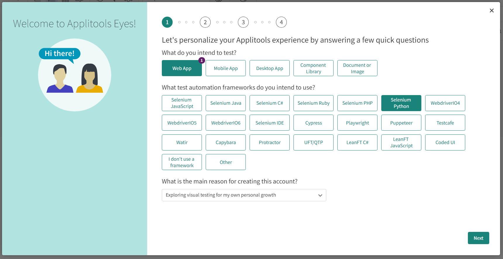
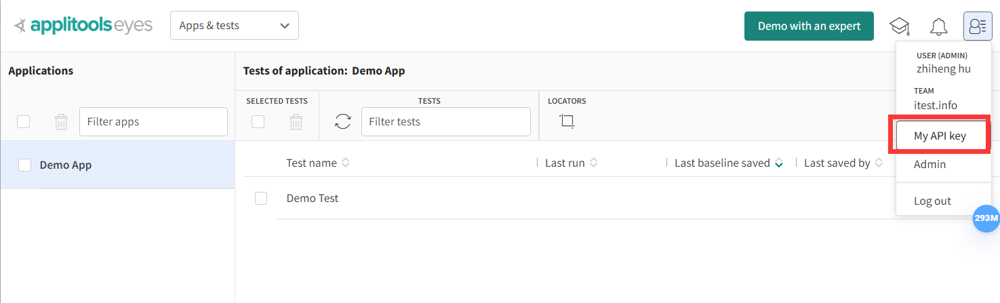
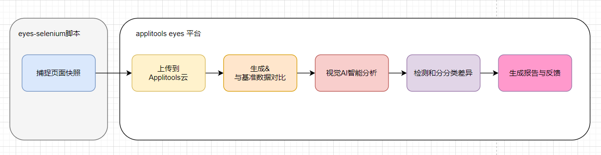
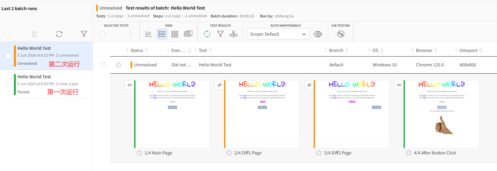
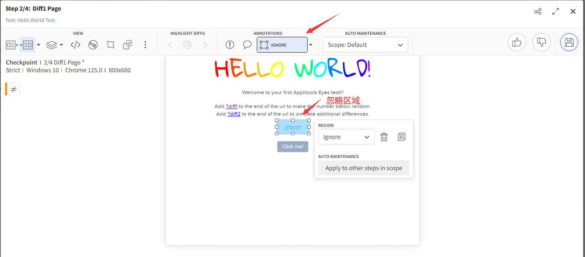
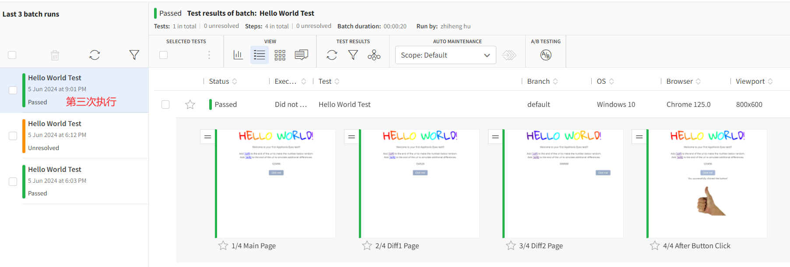

##  applitools

Applitools 是一家专注于视觉AI的自动化测试和监控解决方案的公司，其核心产品围绕着视觉回归测试和UI测试。

__Applitools Eyes__

Applitools Eyes 是其旗舰产品，是一个基于AI的自动化测试工具，专注于检测和修复UI错误。它使用视觉AI来识别界面的变化，并能够跨不同浏览器和设备进行比较，确保UI的一致性和正确性。

### 注册平台账号

__1.注册账号__


__2.提供的功能__



可以看到 Applitools Eyes! 提供了不同应用类型的，以及编程语言和测试库的支持。


__3.获取API_key__



进入测试管理界面，有上角点击账号，在下拉列表中选择`My API key`，弹窗讲会得到一个API key 的字符串。


### 编写自动化脚本

以 Python + selenium 组合编写用例。

```python
from selenium import webdriver
from selenium.webdriver.common.by import By
from applitools.selenium import Eyes, Target, Configuration


# 初始化 Selenium WebDriver
driver = webdriver.Chrome()

# 初始化 Applitools Eyes
eyes = Eyes()
eyes.api_key = "API_key"  # 把 'YOUR_API_KEY' 替换为你的 Applitools API Key

try:
    # 创建一个新的测试实例配置
    config = Configuration()
    config.app_name = 'Applitools Hello World Demo'
    config.test_name = 'Hello World Test with Links and Button'

    # 开始视觉测试
    with eyes.open(
            driver,app_name="Hello World App",
            test_name="Hello World Test",
            viewport_size={'width': 800, 'height': 600}):

        # 访问目标页面
        driver.get("https://applitools.com/helloworld")

        # 检查主页面
        eyes.check("Main Page", Target.window())  # 检查整个浏览器窗口的视觉

        # 点击第一个 diff 链接
        driver.find_element(By.CSS_SELECTOR, 'a[href="?diff1"]').click()
        eyes.check("Diff1 Page", Target.window())

        # 返回主页面
        driver.back()

        # 点击第二个 diff 链接
        driver.find_element(By.CSS_SELECTOR, 'a[href="?diff2"]').click()
        eyes.check("Diff2 Page", Target.window())

        # 返回主页面
        driver.back()

        # 点击按钮
        driver.find_element(By.TAG_NAME, 'button').click()

        # 检查按钮点击后的页面
        eyes.check("After Button Click", Target.window())

        # 结束视觉测试并关闭浏览器
        eyes.close()
finally:
    driver.quit()
    eyes.abort()
```

* 在代码中 `API_key` 替换为平台上获取的用户API_key。

* `eyes.check()` 用于进行视觉检查， `Target.window()` 表示检查整个窗口。

先不用着急执行脚本，有两个问题需要先弄理解清除。


### Applitools Eyes 视觉检查

Applitools Eyes 进行的视觉检查涉及以下几个方面：

__视觉检查的内容__

1. **页面布局**：比较屏幕截图，确保元素的位置一致。

2. **元素可见性**：检查页面上元素的可见性，确保所有该显示的元素都显示了。

3. **颜色和样式**：比较页面元素的颜色和样式，包括字体、背景颜色、边框等。

4. **页面内容**：确保页面内容（如文本、图像）的正确性和一致性。

__视觉检查和验证__

与传统的功能测试不同，视觉测试更多的是在于捕捉视觉变化，而不仅仅是HTML结构或属性的变化。例如：

- **元素是否按照预期位置进行渲染**。

- **颜色和样式是否按照预期展现**。

- **文本内容和图片是否完整且正确**。

__视觉检查失败的情况__

Applitools Eyes 进行的视觉检查失败主要基于页面快照与基准图像（Baseline Image）的对比。当以下情况发生时，页面会出现检查失败：

1. **元素丢失或多余**：
   - 页面缺失重要的UI元素或出现多余元素。
   
2. **位置变化**：
   - 元素的位置与基准图像不匹配，可能因为CSS改变导致布局错误。

3. **颜色和样式变化**：
   - 元素的颜色、字体、边框等样式与基准图像存在显著差异。

4. **内容变化**：
   - 元素的文本内容发生变化（文本错误或内容更新未被允许的情况）。
   - 图片或其他媒体内容不一致。

5. **布局错乱**：
   - 页面元素重叠或者错位，破坏了UI的完整性。

6. **视觉细节**：
   - 细微的视觉差异，如阴影、过渡效果等，与基准图像的预期不符。

__基准图像（Baseline Image）__

在首次运行视觉测试时，Applitools会捕捉当前页面状态作为基准图像。随后所有的测试都将与这一基准进行比较。基准图像的管理和更新对保持测试的有效性至关重要：

- **更新基准图像**：当UI发生合法变化时，你需要手动更新基准图像，以便后续测试参考最新的
页面状态。
- **容忍设置**：在某些情况下，你可以配置容忍度，以忽略较小的差异，例如颜色的微小差别。

总结而言，`eyes.check("Main Page", Target.window())` 进行的是整个页面的视觉验证，从布局到颜色、从文字到图像的全方位检测，任何与基准图像的不一致都可能导致检查失败。


### Applitools Eyes 工作原理

Applitools Eyes 的工作原理主要包括以下几个步骤：

1. **截取快照（Snapshots）**：
    - 当你调用 `eyes.check(...)` 方法时，Applitools Eyes 会通过驱动（如Selenium WebDriver）截取当前页面或视图的屏幕快照。
    - 这些快照会捕捉整个页面、特定部分或者具体元素，取决于你配置的检查目标（例如，整个窗口或某个特定元素）。

2. **图片上传与处理**：
    - 截取的快照将被上传到 Applitools 的云端服务。
    - 在云端，Applitools 会对这些图像进行处理和优化，以便后续的对比和分析。

3. **基准图像（Baseline Images）**：
    - 在第一次运行测试时，Applitools Eyes 会将这些快照存储为基准图像（Baseline Images）。
    - 后续的每次测试将生成新的快照，并与基准图像进行对比。

4. **智能对比（Smart Comparison）**：
    - Applitools 使用了一种称为 **视觉AI（Visual AI）** 的技术来进行智能对比。
    - 这个AI系统采用了计算机视觉和机器学习算法，能够识别和处理图像中的元素和细节。
    - 除了简单的像素对比， **视觉AI（Visual AI）** 可以了解不同上下文中的UI元素，识别布局、样式和内容的变化。

5. **差异检测和分析（Difference Detection and Analysis）**：
    - 通过智能对比，Applitools Eyes 可以识别图像中的差异。这些差异可以是位置变化、样式变化、内容变化等。
    - AI系统会标记并分类这些差异，将其区分为“重大问题”、“微小变化”或“无关紧要”的变动。

6. **容忍设置和忽略区域**：
    - 在某些情况下，用户可以设置容忍值或忽略某些特定区域，以避免不必要的测试失败。
    - 例如，动态内容（广告、日期和时间等）可以被标记为忽略区域。

7. **与基准图像更新**：
    - 当合法的UI变化被接受时，可以将这些测试结果更新为新的基准图像。
    - 如此一来，下一次的测试将基于最新的UI状态进行对比。

8. **结果报告和反馈**：
    - Applitools Eyes 会生成详细的报告，列出所有发现的差异，并提供视觉反馈。
    - 这些报告可以集成到DevOps流水线中，帮助开发和测试团队快速识别和修复UI问题。

### 工作流程概述




### 运行测试

```shell
> python first_demo.py
```


**第一次运行**：
  - 页面加载商品列表，调用 `eyes.check("Product List", Target.window())` 捕捉整个页面快照。
  - 快照上传到 Applitools 云并存储为基准图像。

**第二次运行**（后续测试）：
  - 页面再次加载，捕捉当前页面的快照。
  - 新快照上传到云端，与之前的基准图像进行智能对比。
  - `Visual AI` 系统检测和分析差异，发现某些商品的价格变了、布局发生变化。



**差异处理**：
    - 开发者查看报告，决定这些变化是预期的还是错误的。
    - 如果变化是预期的（例如调整了布局或价格修改是正常行为），基准图像可以更新。
    - 如果是错误的，开发团队可以及时修复问题。

两个diff页面时失败的，原因是页面中间一串随机数据，导致页面视觉检查失败。但是第二个diff页`按钮`的位置发生了改变，视觉检查会忽略这个问题。

如果认为随机数是可以跳过的，可以点击 失败的图片，通过`IGNORE` 工具选择忽略的区域，并保存。




**第三次运行**（后续测试）：
  - 页面再次加载，捕捉当前页面的快照。
  - 新快照上传到云端，与之前的基准图像进行智能对比。
  - `Visual AI` 系统检测和分析差异，发现某些商品的价格变了、布局发生变化。



由于已经添加了忽略区域，`Visual AI` 跳过忽略区域，所以第三次运行是时通过的。

### 最后

Applitools中还有许多功能，但是经过了一定的探索后发现Applitools的核心功能就是：`图像对比`。

有过UI自动化测试经验的人都知道，图像对比对于UI测试来说有其使用场景，尤其在一些元素很难定位的情况下，或者要检查的页面元素很多，包括一些颜色、元素位置等。那么截图对比是比较省事儿的做法。但是，我截图对比一般使用的 opencv库来实现，然后再加一个相似度的参数，这种粗暴的截图对比又会带来新的问题，比如，有些元素的位置可以忽略，账号名不同可以忽略。那又必须要人工介入，做进一步的识别判断。

Applitools的AI经过了上亿张图片进行训练，它不基于像素点去比对图片（因为这会产生大量负面的正例）。它通过模拟人的眼睛去识别图像之间的错误。人眼会忽略的错误，它也会忽略，而对于人眼来说显著的错误，它也能识别出来。

目前Applitools的识别正确率高达99.9999%，这意味着你在调用它一百万次测试中只能找出一个负面的正例。

可以看出Applitools的宗旨并没有偏离真正的测试，将误报率看的非常重。虽然说后面的`人眼算法` 听起来有点玄乎了，但也不否定他的图像识别技术可能确实有他的独到之处。

总的来说，我们在进行UI 自动化的时候看则重点是`功能的可用性`还是`视觉检测`，或者二者兼有，那么把一些重要的的页面交由 `Visual AI`来完成应该是一个很好的选择。

