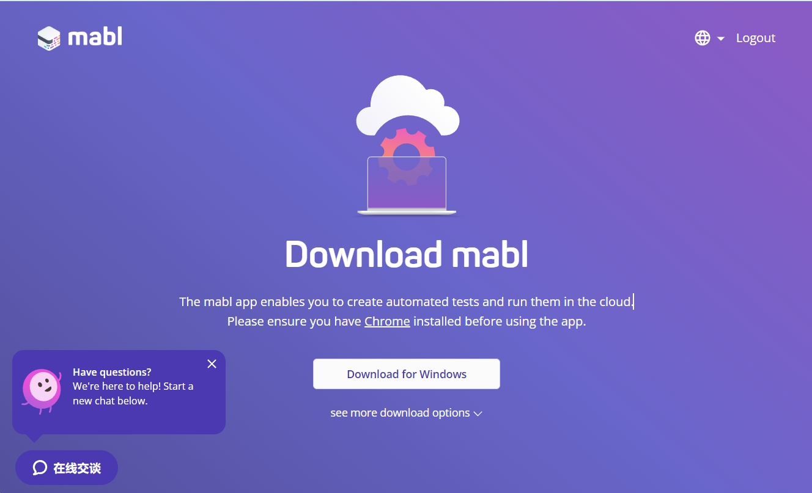
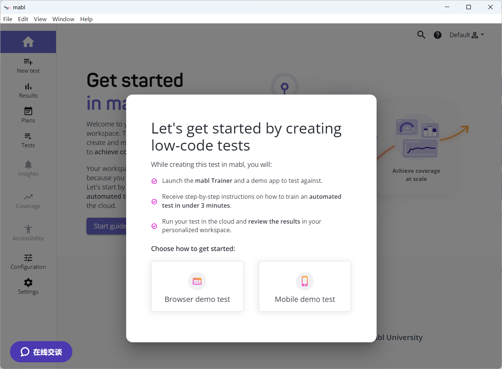
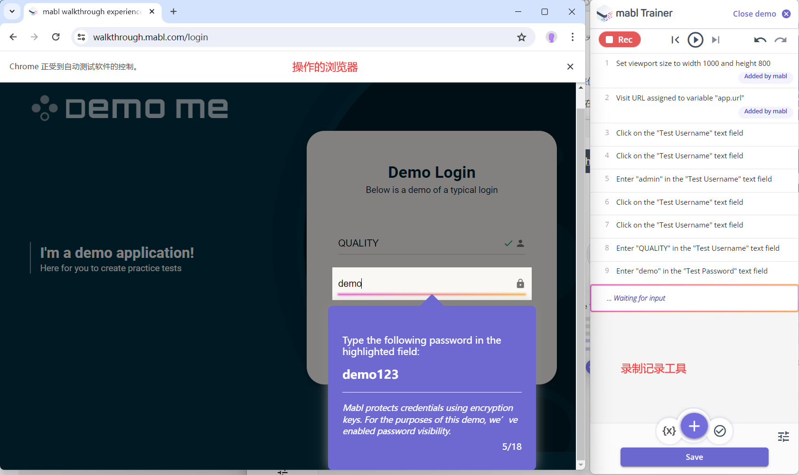
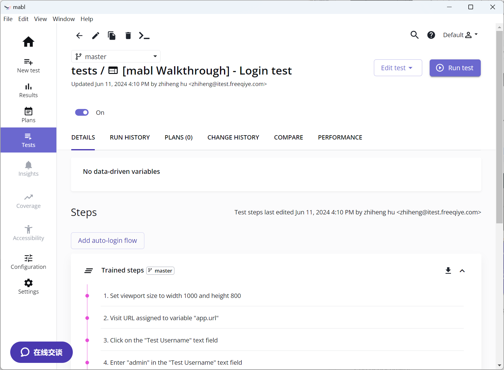
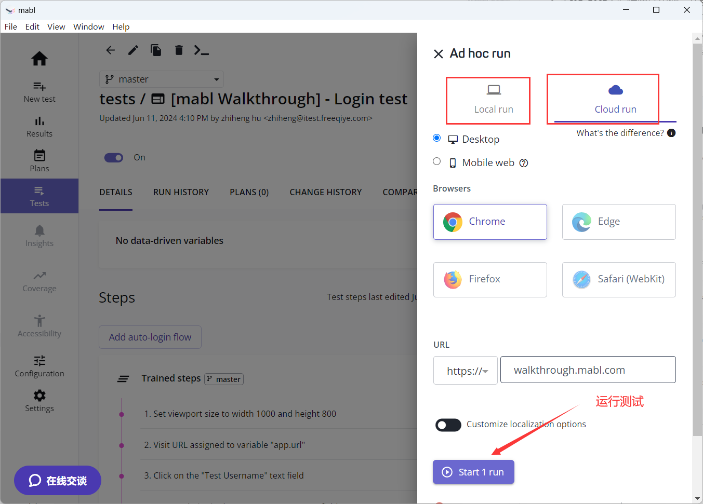
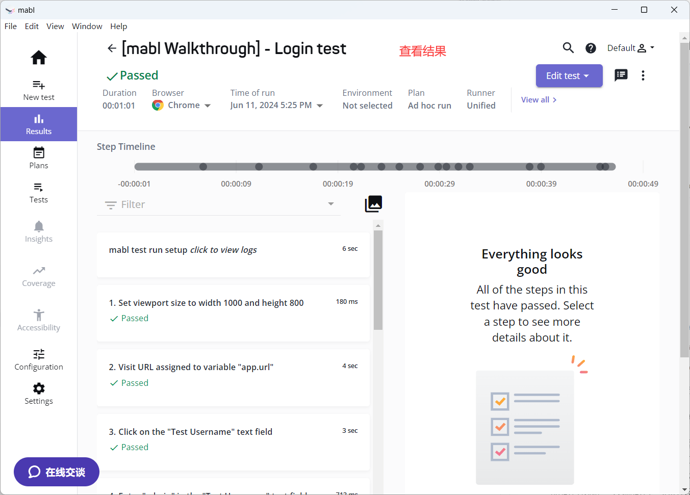
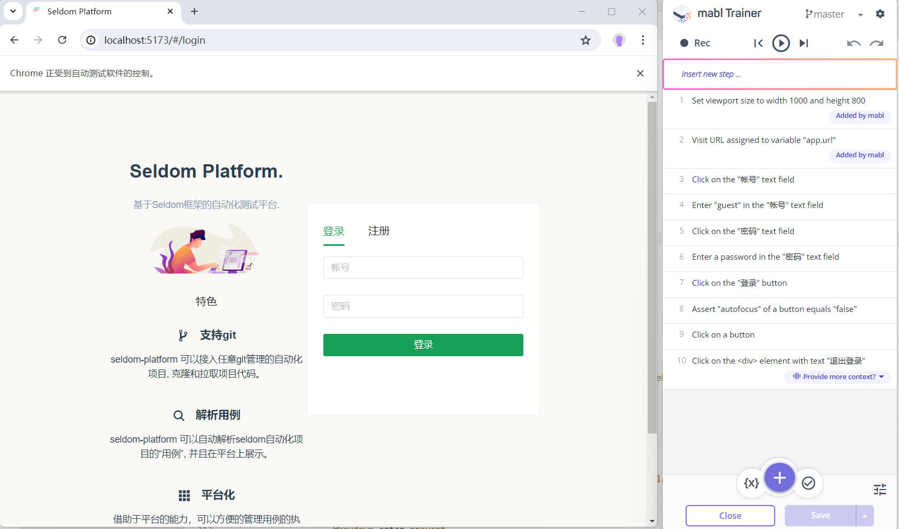
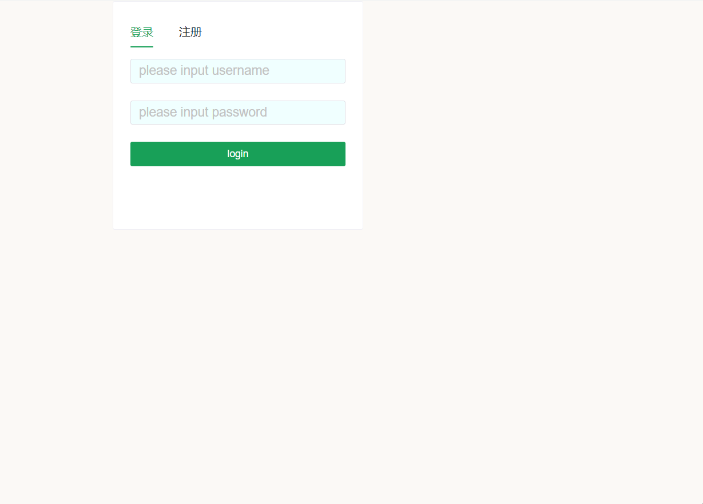
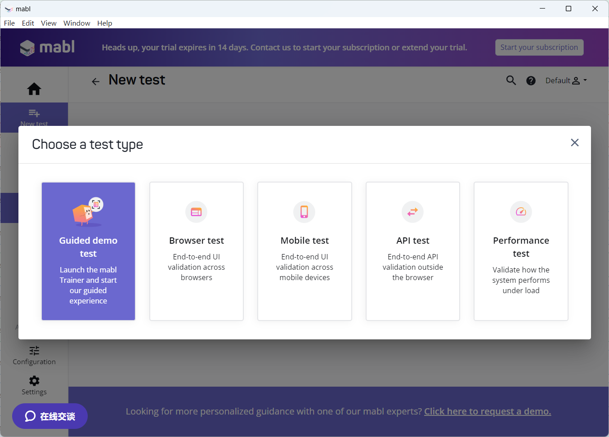

## MABL 

Mabl 是一个综合性的自动化测试平台，旨在简化和加速软件测试过程，特别是Web应用的测试。它利用人工智能和机器学习技术来提供智能化、自动化的测试解决方案。

**人工智能测试自动化**

利用人工智能开启软件测试的未来mble利用多种人工智能技术，包括生成式人工智能来扩展测试覆盖范围，提高可靠性并减少维护。

**通过协作实现更好的质量**

在我们测试的使命中，mabl为非技术和业务用户提供了最佳的低代码体验，同时还为开发人员提供了完整的代码灵活性，并为人工智能应用程序的复杂场景和意图验证提供了人工智能辅助。

**用统一的云原生平台打破孤岛**

mabl是一个现代的、安全的、云原生的平台，旨在实现可扩展性，提供一种无与伦比的统一方法，跨网络、移动、API、可访问性和性能测试的软件质量。

### 注册平台账号

__1.注册账号__

https://www.mabl.com/trial-registration

> 注：必须使用企业邮箱注册。

__2.安装mabl应用__

登录成功，Mabl 提供了按钮，下载并安装mabl。



> 注：请确保在使用该应用程序之前安装了Chrome浏览器。


### 创建测试脚本

__1. 登录mabl客户端__

当安装完成mabl客户端之后，通过测试的账号登录。



__2. 完成一个浏览器测试__

点击 `Browser demo test` 按钮，mabl会启动一个 `mabl Trainer`工具，以及一个chrome浏览器窗口。



根据提示，完成一个demo的`登录`和`退出`，包括`断言`。  `mabl Trainer` 记录整个操作过程。

__3. 查看测试用例__

在 `tests` 管理中可以找到录制的用例。



可以点击按钮：`Edit test` 和 `Run test` 。

* `Edit test`: 编辑测试用例，在录制操作的过程中，会有重复，或操作错误的动作，这些动作页会被录制下来。需要进行编辑和修改。

* `Run test`：运行测试用例，分为本地运行 和 云端运行。 本地运行顾名思义就是本地启动浏览器运行测试；云端运行，利用云端部署的环境运行测试。


__4. 运行测试__

点击`Run test` 弹出侧边栏，选择运行方式。



运行完成，查看结果跳转到 `Results` 页面，查看运行结果。




### Testim.io的 AI 能力

Mabl 利用 AI（人工智能）和机器学习技术，提升测试的效率和效果。以下是 Mabl 提供的一些关键 AI 相关能力：

1. **自动化测试生成与维护**：
   - `智能录制和重放`：Mabl 利用 AI 技术来自动生成测试脚本。通过用户在应用中的操作，Mabl 可以智能地录制这些操作并生成相应的测试脚本。
   - `自动测试修复`：当应用发生变化（如UI更新）导致测试失败时，Mabl 的 AI 技术能够自动识别并更新测试脚本，从而减少维护工作。


2. **异常检测和根因分析**：
   - `智能异常检测`：通过机器学习算法，Mabl 能够自动检测应用中的异常行为，这包括性能下降、UI异常、错误信息等，从而帮助团队尽早发现潜在问题。
   - `根因分析`：Mabl 的 AI 能力还可以帮助分析这些异常的根本原因，通过历史数据和模式识别，定位问题的源头。

3. **高级分析和报告**：
   - `自动化测试报告`：Mabl 可以生成详尽的测试报告，并使用 AI 技术对测试结果进行深入分析，提供趋势分析、问题分类和影响评估等。
   - `可视化和洞察`：通过数据可视化工具，Mabl 可以呈现测试数据趋势和洞察，帮助团队更好地理解应用的健康状况和性能指标。

4. **自适应测试执行**：
   - `动态测试执行`：Mabl 的 AI 能力允许平台根据项目的动态变化来优化测试执行策略，自动选择最适合当前状态的测试，以提高测试覆盖率和效率。
   - `优先级测试`：AI 技术可以帮助确定哪些测试需要优先执行，从而在有限的时间内最大化测试效益。

5. **跨浏览器和设备测试**：
   - `智能兼容性测试`：Mabl 支持跨多浏览器和多设备的测试，通过AI分析不同环境中的测试结果，确保应用在所有支持的环境中表现一致。

### mabl 工作过程

mabl 录制的脚本，非常接近我们的自然语言描述。

>   1. Set viewport size to width 1000 and height 800
>   2. Visit URL assigned to variable "app.url"
>   3. Click on the "Test Username" text field
>   4. Enter "QUALITY" in the "Test Username" text field
>   5. Click on the "Test Password" text field
>   6.  Enter "demo123" in the "Test Password" text field
>   7.  Click on the "LOG IN TO DEMO ME" button

以下是这种过程背后的工作过程/原理：

1. **录制测试步骤**
当用户录制测试步骤时，Mabl 会监控用户在浏览器中的操作。这包括用户点击、输入以及与页面元素的交互。Mabl 将这些操作记录下来，并将其转换成可以理解的自然语言描述。

2. **解析和转换自然语言指令**
Mabl 将录制的自然语言描述转换成可执行的测试指令。这一步涉及以下几个关键过程：

- 自然语言处理（NLP）：Mabl 使用自然语言处理技术来解析用户输入的描述，从中提取出操作的关键要素。例如，从描述“Click on the 'Test Username' text field”中，Mabl 可以提取出动作（click）、目标元素（Test Username text field）等关键信息。
- 测试DSL（域特定语言）：Mabl 可能使用内部的DSL，将自然语言转换成适用于自动化测试执行的指令。这个DSL可以定义一组标准操作和参数，使得生成的指令能够被统一处理。
- UI元素标识：在解析过程中，Mabl 需要识别和定位用户操作的具体UI元素（如文本框、“Test Username”字段等）。这通常通过元素的唯一标识符、XPath、CSS选择器等实现。

3. **执行测试**
在测试执行阶段，Mabl 使用转换后的指令在浏览器环境中自动执行操作：

- 页面操作模拟：Mabl 模拟用户操作，如调整窗口大小（Set viewport size）、访问指定URL（Visit URL）、点击某个元素（Click on...）和输入文本（Enter...）。
- 访问变量：对于涉及变量的操作，如访问URL assigned to variable "app.url"，Mabl 会在执行时替换变量为实际值。

4. **结果捕捉和验证**
- 监控和捕捉：在测试执行过程中，Mabl 监控页面行为和响应。例如，捕捉加载时间、元素的可见性、错误信息等。
- 自动断言：Mabl 可以使用预定义的断言来验证操作结果是否符合预期。例如，检查元素是否存在、文本是否正确、页面是否加载等。

5. **AI和机器学习的应用**
AI和机器学习在Mabl的自动化测试中扮演了重要角色，包括：

- 自动识别和修复：当页面发生变化导致测试失败时，Mabl 的AI引擎尝试识别和修复问题。例如，页面布局变化导致元素位置改变，AI引擎可以重新定位元素。
- 智能异常检测：AI可以帮助识别异常行为，如页面加载性能下降、布局异常等。

### 验证AI 元素定位的能力


通过了解mabl提供的AI能力和执行过程，这里就拿一个元素定位这一点来验证AI能力。

首先，我自己本地启动了就一个Web系统，这样方便我自己修改页面。

__1. 启动Web项目__

本地启动一个Web项目，页面是长这个样子的。


* 前端代码

```html
<input type="text" class="n-input__input-el" placeholder="请输入帐号" size="20">
<input type="password" class="n-input__input-el" placeholder="请输入密码" size="20">
```

前端代码查看登录并没有明显的`ID`、`name` 属性。

__2. 录制自动化脚本__

点击右上角`NEW TEST` 按钮，新建一条用例，开始`Start recording`按钮开始录制。

> 这里发现，可以不用操作 Testim Edit 浏览器插件，直接在 Testim 平台里新见一条用例输入 URL，开始录制即可。



这里录制了一个简单的`登录`->`退出`的流程。

* 录制的脚本描述

```
1. Set viewport size to width 1000 and height 800
2. Visit URL assigned to variable "app.url"
3. Click on the "帐号" text field
4. Enter "guest" in the "帐号" text field
5. Click on the "密码" text field
6. Enter a password in the "密码" text field
7. Click on the "登录" button
8. Assert "autofocus" of a button equals "false"
9. Click on a button
10. Click on the <div> element with text "退出登录"
```

__3. 修改登录页面__

以下是我尝试做的一些修改。

* 录制的时候，输入框有默认填充，移除默认填充。
* 修改登录输入框的位置。
* 修改登录窗口背景色和字体大小。
* 修改输入框的属性。
* 修改中文提示该为英文。
* 修改密码框为普通的文本框（密码输入可见）。



通过截图看到，登录窗口已经做了比较大的修改。

__4. 重跑录制的脚本__

结论，**录制的脚本依然可以正常执行**。

### 总结

mbal 是一个比较成熟的自动化测试平台。



* 支持 Web 测试。
* 支持 App 测试。
* 支持 API 测试。

支持测试计划、测试结果、覆盖率等功能。使用体验和 testim 类似（请阅读我的上一篇testim的介绍），但是，我更喜欢他的用例步骤描述，相比testim每个步骤是一个截图。

mabl 和 testim 一样，利用AI技术提升 UI 自动化的稳定性。相比 selenium/playwright 等基于元素属性定位的工具有优势。

在体验的过程中我一直在思考，为什么这样 AI加持的自动化测试平台没有普及？至少国内我没听过哪个公司在用这样的平台。

* 技术路线惯性：自从selenium开源自动化测试工具普及之后，普遍认知自动化测试工具就应该用开源的，cypress/playwright也是以开源迅速得到普及。其次，我们有太多的框架/平台是基于selenium等设计的，包括技术积累，也不太可能直接抛弃掉这些框架/平台和技术积累。

* 非颠覆式的创新：虽然 mabl 和 testim 有AI加持，但是：录制脚本、测试计划、测试结果 这些自动化测试流程并没有改变，元素定位只是自动化测试的一个点，我们还是要设计和组织用例，执行以及查看结果。除非出现高级智能的类似 monkey 工具，不需要设计用例，自动执行。

* 价格：我在他们的官网上没有看到结果，需要人工咨询。参考国内的apifix的价格也不是个人能负担得起得。有现成的具备自动化技术的测试工程师，当然是用开源的了。
