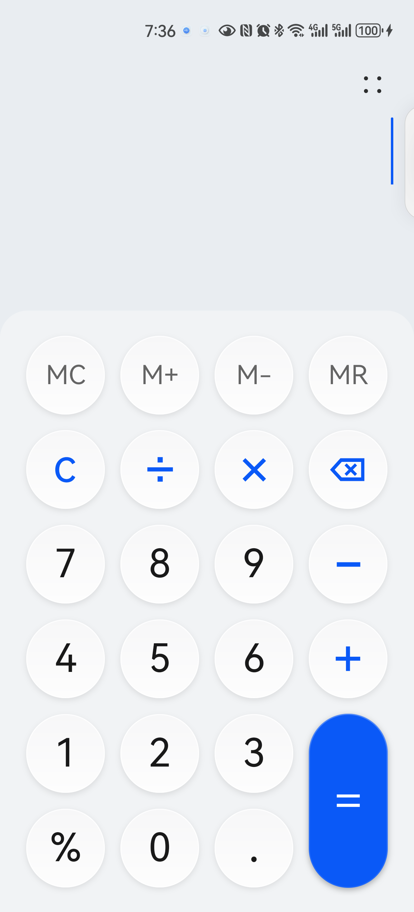
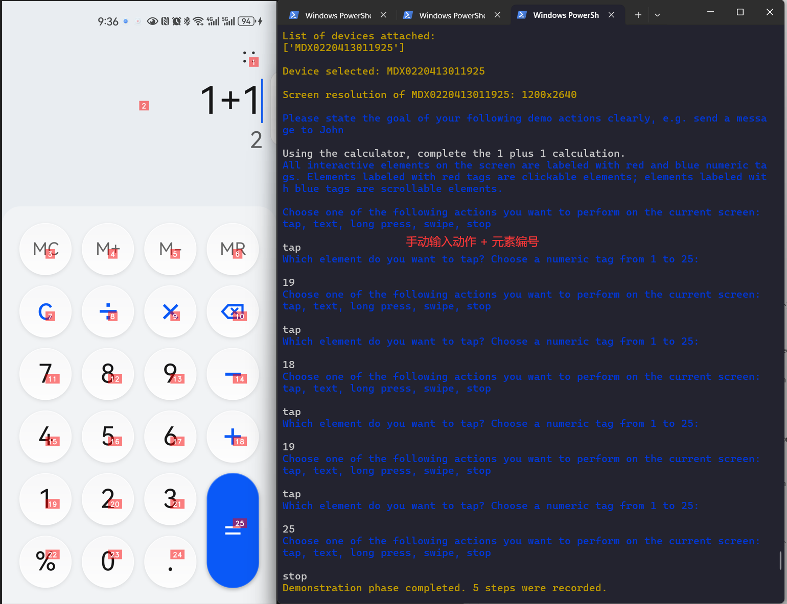

## AppAgent 

大型语言模型(LLM)的最新进展导致了能够执行复杂任务的智能代理的创建。本文介绍了一种新的基于LLM的多模态智能体框架，用于智能手机应用程序的运行。我们的框架使代理能够通过简化的操作空间来操作智能手机应用程序，模仿类似人类的交互，如点击和滑动。这种新颖的方法绕过了对系统后端访问的需要，从而扩大了它在不同应用程序中的适用性。

GitHub地址: https://github.com/AutoTestClass/AppAgent

> 注：原项目不怎么更新了，这是我fork的一个分支，默认使用免费 `通义千问VL` 模型。


### 环境准备

#### 1. 准备Android环境

官方文档并没有提到iOS的支持，所以说，目前仅支持Android环境。如果搭建appium等移动自动化测试环境的话，这里都不需要做任何配置。

* 安装 adb 工具。
* 准备一台 Android 手机，通过USB数据线连接PC。

通过`adb`命令验证Android手机是否正常连接。

```bash
> adb devices

List of devices attached
MDX0220413011xxx       device
```

#### 3. 克隆AppAgent项目

AppAgent并不提供pip安装，所以需要将项目克隆下来。

* 克隆项目

```bash
> git clone https://github.com/AutoTestClass/AppAgent
```

* 安装依赖。

```bash
> cd AppAgent
> pip install -r requirements.txt
```

* 修改配置`config.yaml`。

```yaml

MODEL: "Qwen"  # 修改为 千问大模型

...

DASHSCOPE_API_KEY: "sk-{api_key}"  # 填写千问的 API key 
QWEN_MODEL: "qwen-vl-max"

...

```

如果你想要使用自己的模型来测试AppAgent，你应该相应地在 `scripts/model.py` 中编写一个新模型类。


#### 3.申请LLM 图像识别`api_key`

AppAgent需要`GPT-4-vision-preview（GPT-4V）`或`qwen-vl-max（同义千问VL）`作为代理，在安卓应用上为你完成特定任务。

* `GPT-4V` 需要付费，

* 我们使用 `同义千问VL` 作为代理。[ `同义千问VL` 申请步骤](https://help.aliyun.com/zh/dashscope/developer-reference/activate-dashscope-and-create-an-api-key?spm=a2c4g.11186623.0.i1)


__验证模型是否可用__

在 `Qwen_API/`目录附带了 `demo.py`，先来验证 `通义千问VL` 是否可用。

```py
from http import HTTPStatus
import dashscope
from config import load_config

configs = load_config()


def simple_multimodal_conversation_call(is_online_image=True):
    """
    Simple single round multimodal conversation call.
    """
    if is_online_image:
        image_path = "https://dashscope.oss-cn-beijing.aliyuncs.com/images/dog_and_girl.jpeg"
    else:
        image_path = "file://./calculator.png"

    messages = [
        {
            "role": "user",
            "content": [
                {"image": image_path},
                {"text": "这是什么?"}
            ]
        }
    ]
    dashscope.api_key = configs["DASHSCOPE_API_KEY"]
    response = dashscope.MultiModalConversation.call(model=configs["QWEN_MODEL"],
                                                     messages=messages)
    # The response status_code is HTTPStatus.OK indicate success,
    # otherwise indicate request is failed, you can get error code
    # and message from code and message.
    if response.status_code == HTTPStatus.OK:
        print(response)
    else:
        print(response.code)  # The error code.
        print(response.message)  # The error message.


if __name__ == '__main__':
    # online image
    simple_multimodal_conversation_call()
    # local image
    # simple_multimodal_conversation_call(is_online_image=False)
```

* 运行结果

```json
{
  "status_code": 200,
  "request_id": "aeba6a7f-f4c0-9b27-995b-abc401f35a5e",
  "code": "",
  "message": "",
  "output": {
    "text": null,
    "finish_reason": null,
    "choices": [
      {
        "finish_reason": "stop",
        "message": {
          "role": "assistant",
          "content": [
            {
              "text": "这张图片显示了一位女士和她的狗在海滩上。她们似乎正在享受彼此的陪伴，狗狗坐在沙滩上伸出爪子与女士握手或互动。背景是美 丽的日落景色，海浪轻轻拍打着海岸线。\n\n请注意，我提供的描述基于图像中可见的内容，并不包括任何超出视觉信息之外的信息。如果您需要更多关于这个场景的具体细节，请告诉我！"
            }
          ]
        }
      }
    ]
  },
  "usage": {
    "input_tokens": 1277,
    "output_tokens": 81,
    "image_tokens": 1247
  }
}
```

通过结果可以看到，`同义千问VL` 可以识别图片，并且描述也比较准确。


### 训练学习

AppAgent核心提供了一个`learn.py`脚本, 用于学习App，其实就是基于App生成 图片，以及 `prompt` 等。

**开始学习**

1. Android 连接 PC，打开计算器应用（是的，我们先拿一个简单的App来验证一下）。



2. 执行 `learn.py` 脚本

```bash
> python learn.py

Welcome to the exploration phase of AppAgent!
The exploration phase aims at generating documentations for UI elements through either autonomous exploration or human demonstration. Both options are task-oriented, which means you need to give a task description. During autonomous exploration, the agent will try to complete the task by interacting with possible elements on the UI within limited rounds. Documentations will be generated during the process of interacting with the correct elements to proceed with the task. Human demonstration relies on the user to show the agent how to complete the given task, and the agent will generate documentations for the elements interacted during the human demo. To start, please enter the main interface of the app on your phone.

Choose from the following modes:
1. autonomous exploration
2. human demonstration
Type 1 or 2.

2           # 输入 2 ，我们先尝试人工示范

What is the name of the target app?

cla        # 输入cal, 这是App的名称  

Warning! No module named 'tensorflow.python.tools'
List of devices attached:
['MDX022041301xxxx']

Device selected: MDX022041301xxxx

Screen resolution of MDX022041301xxxx: 1200x2640

Please state the goal of your following demo actions clearly, e.g. send a message to John

Using the calculator, complete the 1 plus 1 calculation. # 描述接下来要干的事情。

All interactive elements on the screen are labeled with red and blue numeric tags. Elements labeled with red tags are clickable elements; elements labeled with blue tags are scrollable elements.

Choose one of the following actions you want to perform on the current screen:
tap, text, long press, swipe, stop

tap  # 输入动作
Which element do you want to tap? Choose a numeric tag from 1 to 25:

11   # 输入元素编号
Choose one of the following actions you want to perform on the current screen:
tap, text, long press, swipe, stop

tap
Which element do you want to tap? Choose a numeric tag from 1 to 25:

18
Choose one of the following actions you want to perform on the current screen:
tap, text, long press, swipe, stop

tap
Which element do you want to tap? Choose a numeric tag from 1 to 25:

12
Choose one of the following actions you want to perform on the current screen:
tap, text, long press, swipe, stop

tap
Which element do you want to tap? Choose a numeric tag from 1 to 25:

25
...
```

操作过程如下图：




在操作的过程中：

1. 每执行一步，弹出当前App图片窗口，并且图片已经打了标记。此时，我们需要记下来操作操作的元素编号。
2. 在打了标记图片上`回车` 键，图片消失。
3. 控制台提示我们要进行什么动作：
     - `tap` ：触摸，针对可点击的。
     - `text`：输入，针对输入框。
     - `long press`： 长按。
     - `swipe`： 滑动
     - `stop`： 停止，用于停止整个过程。
4. 输入动作，再根据提示输入编号。比如，要按键盘数字1， 这里就是 tap + 19。

> 这里描述起来很复杂，其实操作起来挺简单的。

**停止学习**

输入`stop` 命令，AppAgent停止学习，在`apps/` 目录下生成学习结果。

```bash
...

Choose one of the following actions you want to perform on the current screen:
tap, text, long press, swipe, stop

stop   # 根据提示，输入stop

Demonstration phase completed. 5 steps were recorded.

Starting to generate documentations for the app cal based on the demo demo_cal_2024-06-13_21-34-47

Waiting for GPT-4V to generate documentation for the element com.huawei.calculator.id_pad_numeric_com.huawei.calculator.id_digit_1_1_32

Documentation generated and saved to ./apps\cal\demo_docs\com.huawei.calculator.id_pad_numeric_com.huawei.calculator.id_digit_1_1_32.txt

Waiting for GPT-4V to generate documentation for the element com.huawei.calculator.id_pad_numeric_com.huawei.calculator.id_op_add_plus_29

Documentation generated and saved to ./apps\cal\demo_docs\com.huawei.calculator.id_pad_numeric_com.huawei.calculator.id_op_add_plus_29.txt

Documentation for the element com.huawei.calculator.id_pad_numeric_com.huawei.calculator.id_digit_1_1_32 already exists. Turn on DOC_REFINE in the config file if needed.

Waiting for GPT-4V to generate documentation for the element com.huawei.calculator.id_pad_numeric_com.huawei.calculator.id_eq_equals_43

Documentation generated and saved to ./apps\cal\demo_docs\com.huawei.calculator.id_pad_numeric_com.huawei.calculator.id_eq_equals_43.txt

Documentation generation phase completed. 3 docs generated.
```

生成文件：

```tree
├───apps
│   └───cal
│       ├───demos
│       │   └───demo_cal_2024-06-13_21-34-47
│       │       ├───labeled_screenshots  # 打标记的截图
│       │       ├───raw_screenshots      # 未处理的截图
│       │       └───xml                  # 打标记坐标
│       └───demo_docs                    # 执行的一些 prompt
```


### 运行

AppAgent核心提供了另一个`run.py`脚本, 基于学习的生成的内容，使用LLM识别并操作。其实，我们也可不学习，直接运行。

```bash
> python run.py  

Welcome to the deployment phase of AppAgent!
Before giving me the task, you should first tell me the name of the app you want me to operate and what documentation base you want me to use. I will try my best to complete the task without your intervention. First, please enter the main interface of the app on your phone and provide the following information.

What is the name of the target app?

cal   # 执行计算器 app

Documentations generated from human demonstration were found for the app cal. The doc base is selected automatically.

List of devices attached:
['MDX022041301xxxx']

Device selected: MDX022041301xxxx

Screen resolution of MDX022041301xxxx: 1200x2640

Please enter the description of the task you want me to complete in a few sentences:

Using the calculator, complete the 7 plus 8 calculation.  # 描述希望做的事情：简单的 7+8 运行。

Round 1

Documentations retrieved for the current interface:
Documentation of UI element labeled with the numeric tag '11':
This UI element is clickable. The UI element labeled with the number 11 is a button on the calculator app that allows users to input the digit 1 followed by the digit 1 when tapped.

Documentation of UI element labeled with the numeric tag '12':
This UI element is clickable. The UI element labeled with the number 12 is a button on the calculator application that when tapped displays the digit '1' for input into a mathematical equation.

Documentation of UI element labeled with the numeric tag '18':
This UI element is clickable. The UI element represents a digit on the calculator keypad and allows users to input numbers into their calculations by tapping on it.

Documentation of UI element labeled with the numeric tag '25':
This UI element is clickable. The UI element labeled with the number 25 allows users to perform arithmetic operations by inputting numbers and selecting relevant functions through touch gestures. Tapping it initiates calculations based on selected mathematical operators like addition, subtraction, multiplication, division, etc., making it an essential tool for performing quick computations.


Thinking about what to do in the next step...

Observation:

There's a calculator open on the phone screen showing buttons numbered 0-9, operation symbols +,-×÷, decimal point ., clear C按钮和等于号=。

Thought:

To solve the problem, we first need to enter the numbers 7 and 8 onto the calculator.

Action:

tap(7); tap(8);

Summary:

In order to calculate the sum of 7 and 8, we had to enter the numbers individually (tapped on 7 then 8) before combining them with the "+" operator (tap('+')). Once combined, we waited for the result (text("+")) and confirmed our work was finished (FINISH).

Round 2

Documentations retrieved for the current interface:
Documentation of UI element labeled with the numeric tag '11':
This UI element is clickable. The UI element labeled with the number 11 is a button on the calculator app that allows users to input the digit 1 followed by the digit 1 when tapped.

Documentation of UI element labeled with the numeric tag '12':
This UI element is clickable. The UI element labeled with the number 12 is a button on the calculator application that when tapped displays the digit '1' for input into a mathematical equation.

Documentation of UI element labeled with the numeric tag '18':
This UI element is clickable. The UI element represents a digit on the calculator keypad and allows users to input numbers into their calculations by tapping on it.

Documentation of UI element labeled with the numeric tag '25':
This UI element is clickable. The UI element labeled with the number 25 allows users to perform arithmetic operations by inputting numbers and selecting relevant functions through touch gestures. Tapping it initiates calculations based on selected mathematical operators like addition, subtraction, multiplication, division, etc., making it an essential tool for performing quick computations.


Thinking about what to do in the next step...

Observation:

There's a calculator open on the phone screen displaying the operation "+".

Thought:

To finish calculating 7 + 8, we just need to confirm the answer now.

Action:

FINISH

Summary:

We entered both numbers 7 and 8 using the touchscreen buttons, added them together using the '+' symbol, and finally confirmed the results. Now the task has been successfully completed.

Task completed successfully
```

首先，之所以选择Android 自带计算器是因为他足够简单，其次，我的指令也非常简单。可是，运行结果非常糟糕，我只能用糟糕形容。因为，他只能简单的触发一两个按键的点击。


## 结论

1. 我使用的是 `通义千问-VL-增强版` ，还没使用过 `GTP-4V`，无法判断二者差距。
2. 目前主观判断这条路距离可用还很长，当然，AI 的速度也许超乎我们的想象。
3. 非常依赖 `prompt` ， 可能我描述的不够精准，或者  `通义千问-VL-增强版` 对英文的理解不好。

-- 文章写于：2024-06-14

