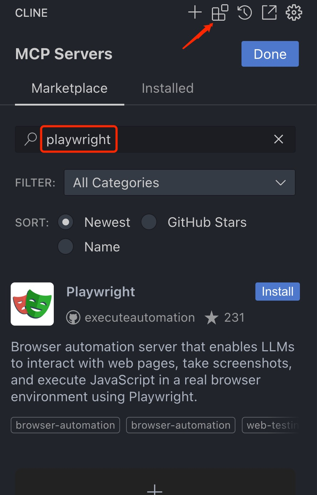
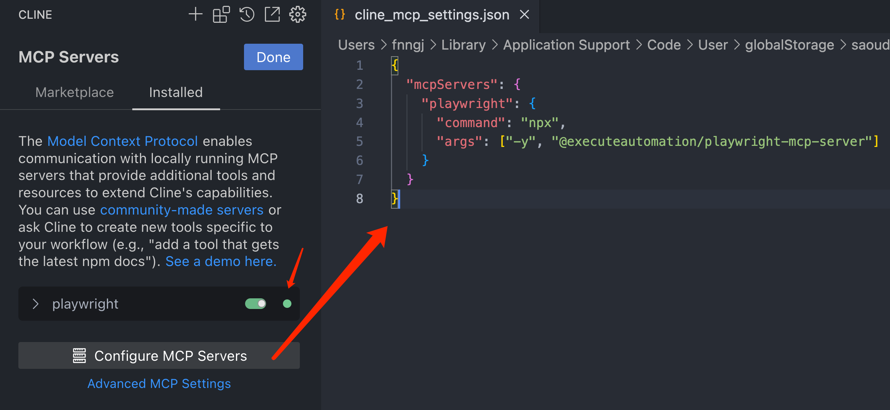
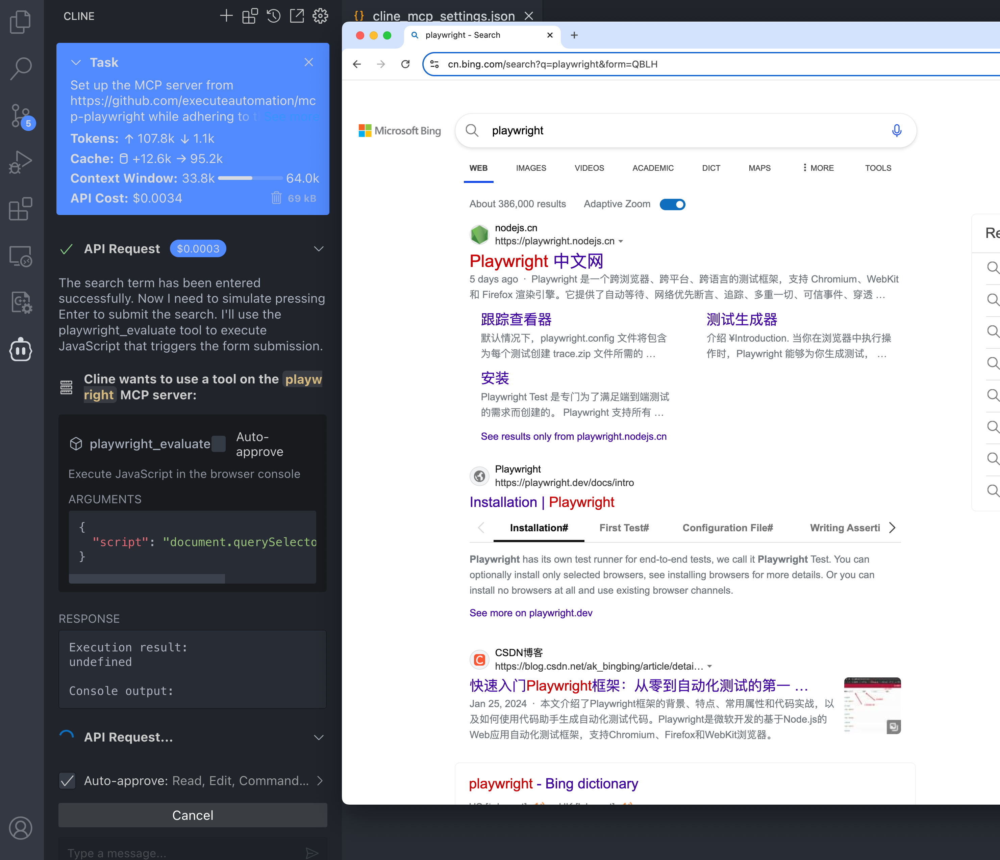
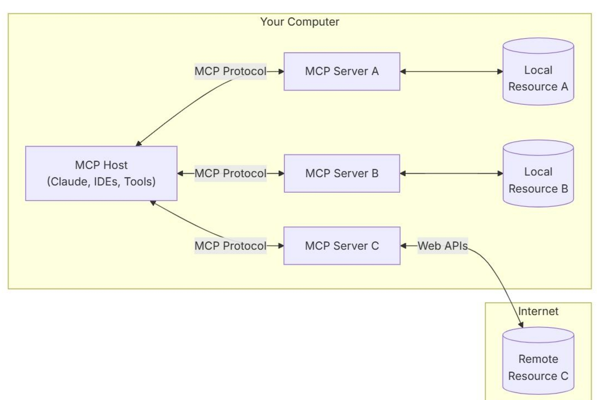
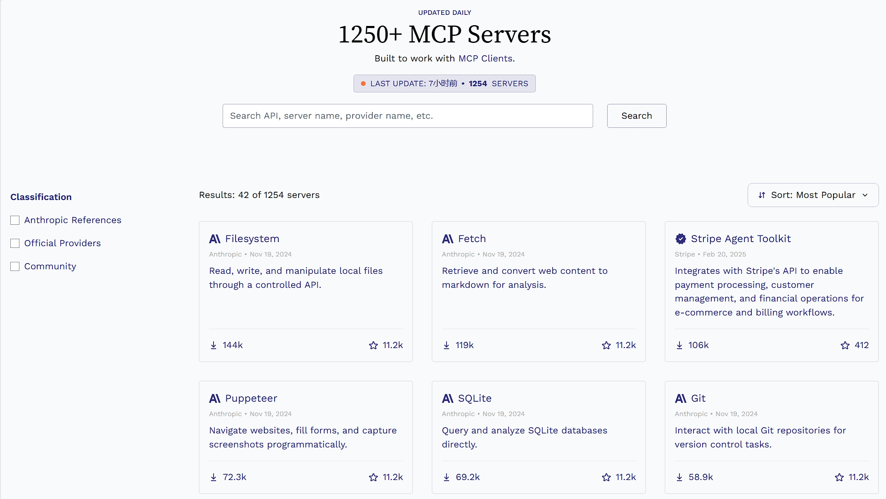

# 一文搞懂 MCP Servers

## 什么是MCP

### MCP概念

MCP（Model Context Protocol，模型上下文协议）是由 Anthropic 提出并于 2024 年 11 月开源的一种通信协议，旨在解决大型语言模型（LLM）与外部数据源及工具之间无缝集成的需求。

它通过标准化 AI 系统与数据源的交互方式，帮助模型获取更丰富的上下文信息，从而生成更准确、更相关的响应。

### 主要功能

* `上下文共享`：应用程序可以通过 MCP 向模型提供所需的上下文信息（如文件内容、数据库记录等），增强模型的理解能力。
* `工具暴露`：MCP 允许应用程序将功能（如文件读写、API 调用）暴露给模型，模型可以调用这些工具完成复杂任务。
* `可组合的工作流`：开发者可以利用 MCP 集成多个服务和组件，构建灵活、可扩展的 AI 工作流。
* `安全性`：通过本地服务器运行，MCP 避免将敏感数据上传至第三方平台，确保数据隐私。

### MCP架构

MCP 采用客户端-服务器架构：

* `MCP 客户端（Client）`：通常是 AI 应用程序（如 Claude Desktop 或其他 LLM 工具），负责发起请求并与服务器通信。
* `MCP 服务器（Server）`：轻量级程序，负责暴露特定的数据源或工具功能，并通过标准化协议与客户端交互。

__通信格式__：基于 `JSON-RPC 2.0`，支持请求、响应和通知三种消息类型，确保通信的标准化和一致性。

## MCP Servers主要功能

MCP Servers 作为一个轻量级的本地服务，旨在为客户端提供数据访问和功能执行的接口。

__1. 资源暴露（Resource Exposure）__

资源是服务器提供给客户端的数据实体，可以是文件、数据库记录、内存中的对象等。

例如：
* 文件资源：`file:///home/user/report.txt`
* 内存资源：`memo://recent-insights`

__2. 工具提供（Tool Provisioning）__

工具是服务器暴露的可执行功能，客户端可以通过调用这些工具完成特定任务。

例如：
* 查询数据库：`query_database`（参数：SQL 语句，返回：查询结果）
* 文件写入：`write_file`（参数：文件路径、内容）

__3. 动态通知（Dynamic Notification）__

当资源发生变化时，服务器可以通过通知机制（如 notification 消息）主动推送更新到客户端。

__4. 会话管理（Session Management）__

处理客户端的连接初始化、能力协商和会话关闭。

### 自定义 MCP Servers

1. 本地实现一个文件资源服务，创建 `mcp_server.py` 文件。

```python
import json
import sys

# 处理客户端请求
def handle_request(request):
    method = request.get("method")
    params = request.get("params", {})
    request_id = request.get("id")

    if method == "initialize":
        return {
            "jsonrpc": "2.0",
            "result": {"version": "1.0", "capabilities": ["resources", "tools"]},
            "id": request_id
        }
    elif method == "read_resource":
        uri = params.get("uri")
        with open(uri.replace("file:///", ""), "r") as f:
            content = f.read()
        return {"jsonrpc": "2.0", "result": content, "id": request_id}
    elif method == "call_tool":
        tool_name = params.get("name")
        if tool_name == "echo":
            return {"jsonrpc": "2.0", "result": params.get("message"), "id": request_id}
    else:
        return {"jsonrpc": "2.0", "error": {"code": -32601, "message": "Method not found"}, "id": request_id}

# 主循环：通过 Stdio 通信
def main():
    while True:
        # 从 stdin 读取请求
        raw_input = sys.stdin.readline().strip()
        if not raw_input:
            break
        request = json.loads(raw_input)
        
        # 处理请求并返回响应
        response = handle_request(request)
        sys.stdout.write(json.dumps(response) + "\n")
        sys.stdout.flush()

if __name__ == "__main__":
    main()
```

2. 通过 python 启动服务

```shell
python mcp_server.py
```

3. 在相同的目录下创建 `test.txt` 文件。

```txt
Hello, this is a test file!
```

4. 另外启动一个命令窗口，输入：

```shell
echo '{"jsonrpc": "2.0", "method": "read_resource", "params": {"uri": "file:///D:/path/to/test.txt"}, "id": 2}' | python mcp_server.py

{"jsonrpc": "2.0", "result": "Hello, this is a test file!", "id": 2}
```
> 注：此处使用的是 PowerShell，我们看到服务返回了文件的内容。

### 使用现有 MCP Servers

GitHub：在 GitHub 上查找 MCP servers：
* https://github.com/modelcontextprotocol/servers
* https://github.com/punkpeye/awesome-mcp-servers

网站：通过下面的网站查找 MCP servers：

* https://mcpservers.org
* https://mcp.so
* https://glama.ai/mcp/servers
* https://www.pulsemcp.com/

UI自动化相关的 MCP servers

* `playwright`: https://github.com/executeautomation/mcp-playwright
* `browserbase`: https://github.com/browserbase/mcp-server-browserbase
* `puppeteer` https://github.com/modelcontextprotocol/servers/tree/HEAD/src/puppeteer

我们以 Playwright 项目为例子。

playwright 项目：https://github.com/AutoTestClass/playwright-mind

在项目里添加 `playwright-mcp-server`：

```shell
git clone https://github.com/AutoTestClass/playwright-mind
cd playwright-mind
npm install -g @executeautomation/playwright-mcp-server # <--添加--
```

## MCP Client

MCP client 一般选用 AI 应用程序（如 Claude Desktop、cline 或其他 LLM 工具），负责发起请求并与服务器通信。

我们这里选用 VSCode + cline 的组合，关于二者的使用，铺天盖地都是使用的文章，这里就不介绍了。

1. 首先，在 VSCode 中打开 cline 插件，在 MCP servers 中搜索 `playwright` 插件安装。



2. 然后，配置 `playwright mcp servers` 的启动配置。



```json
{
  "mcpServers": {
    "playwright": {
      "command": "npx",
      "args": ["-y", "@executeautomation/playwright-mcp-server"]
    }
  }
}
```

3. 最后，通过 LLM 大模型，描述需求（UI 自动化相关操作），LLM 大模型会通过 `playwright MCP servers` 启动浏览器完成一些 UI 自动化操作。



## MCP Servers的作用

最后，我们再来总结 MCP Servers 的作用。懒得画图了，下面是我网上找的一张图。结合前面的操作流程，相信你已经知道 MCP Servers 可以做什么了。



MCP Servers 真正的价值不在于我们传统的 UI 自动化测试，因为它是通过文字描述操作浏览器去完成一些工作。并没有自动化的脚本沉淀，当然，如果你把 `Prompt` 沉淀下来当作自动化脚本也是可以的，这确实颠覆了我们写自动化脚本的形式。
当然，MCP Servers 更多的价值不是浏览器自动化，而是利用 LLM 操作本地资源，例如，本地文件，数据库、git 等。想想 __你不需要写复杂的 SQL 语句，通过自然语言描述就可以轻松完成本地数据库的操作。__ 这种效率的提升是非常明显。


