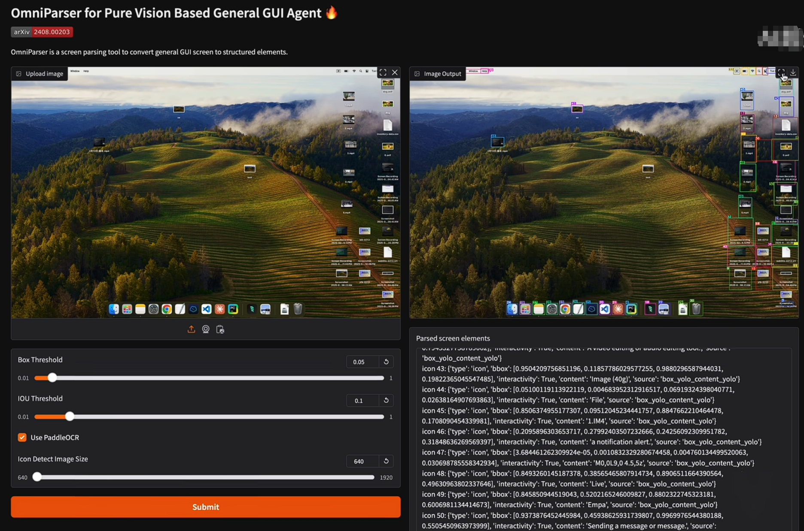
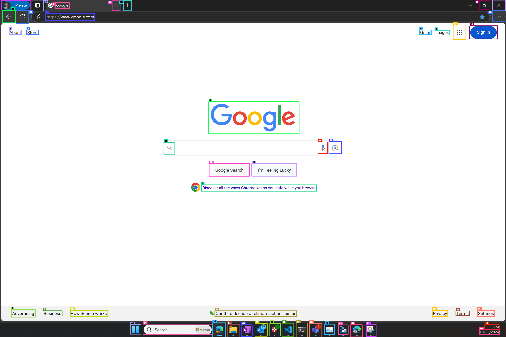

# OmniParser：基于视觉的自动化工具

## 工具介绍

### 什么是 OmniParser？

OmniParser 是 Microsoft 开发的一个屏幕解析工具，最初发布于 2024 年 10 月，并在 2025 年推出了 V2.0 版本。它通过纯视觉的方式，将非结构化的屏幕截图转化为包含可交互区域位置和语义描述的结构化数据。这种能力显著提升了多模态模型（如 GPT-4V）的界面操作精度，使其能够跨平台（Windows、移动设备、网页等）执行任务，而无需依赖底层的 HTML 或视图层次结构。

### 核心功能
- **可交互区域检测**：识别屏幕上的按钮、图标等可点击元素。
- **语义提取**：为检测到的元素生成功能性描述，例如“提交按钮”或“导航链接”。
- **跨平台支持**：适用于 PC、手机及各种应用程序的截图。
- **与 LLM/VLM 集成**：提供结构化输出，便于语言模型进行后续动作预测。

### OmniParser V2 的改进
相比 V1，OmniParser V2 在以下方面有了显著提升：
- **更快的推理速度**：延迟降低了约 60%，在 A100 GPU 上平均每帧 0.6 秒。
- **更高的精度**：在 ScreenSpot Pro 基准测试中，搭配 GPT-4o 达到了 39.6% 的平均准确率。
- **小图标检测**：增强了对细小可交互元素的识别能力。

## 安装步骤

要在本地运行 OmniParser V2，官方建议使用带有 NVIDIA GPU 的 Linux 系统以获得最佳性能。

1. 克隆 OmniParser 仓库
```bash
git clone https://github.com/microsoft/OmniParser.git
cd OmniParser
pip install -r requirements.txt
```

2. 下载模型权重

OmniParser 使用预训练模型（YOLOv8 和 Florence-2），需要从 Hugging Face 下载：

注册账号，并创建token：https://huggingface.co/

> huggingface.co 是由 Hugging Face 公司运营的一个平台，主要专注于机器学习（Machine Learning, ML）、深度学习（Deep Learning, DL）以及自然语言处理（NLP）领域，特别是与大模型（Large Language Models, LLMs）和多模态模型相关的资源管理和社区协作。它的核心目标是为开发者、研究人员和企业提供一个集成的生态系统，用于创建、共享和使用人工智能模型。 简单点理解就是管理 大模型的仓库（和管理代码的仓库 Github 类似）。

```shell
# 输入创建的 token
huggingface-cli login

# 创建 weights 目录
mkdir -p weights

# 下载图标检测和描述模型
huggingface-cli download microsoft/OmniParser-v2.0 --local-dir weights

# 调整目录结构
mv weights/icon_caption weights/icon_caption_florence
```

3. 验证安装

运行示例脚本确认安装成功：

```bash
> python gradio_demo.py

* Running on local URL:  http://0.0.0.0:7861
* Running on public URL: https://1a12130c2975c88380.gradio.live
```

如果成功，通过浏览器打开生成的地址，上传一张照片，OmniParser 将会识别图片中的元素并生成坐标。



脚本将加载默认截图并输出解析结果。


## 自动化应用

以下是一个使用 OmniParser 解析屏幕截图并生成结构化输出的示例。

### 示例代码

假设你有一个名为 `screenshot.png` 的截图文件，内容是一个简单的网页界面。

```python
import base64
from io import BytesIO
import cv2
import numpy as np
from PIL import Image
from util.utils import check_ocr_box, get_yolo_model, get_caption_model_processor, get_som_labeled_img

# 初始化模型
yolo_model = get_yolo_model(model_path='weights/icon_detect/model.pt')
caption_model_processor = get_caption_model_processor(
    model_name="florence2",
    model_name_or_path="weights/icon_caption_florence"
)

# 加载图像
image_cv = cv2.imread("screenshot.png")
if image_cv is None:
    raise FileNotFoundError("无法加载 screenshot.png")
image = Image.fromarray(cv2.cvtColor(image_cv, cv2.COLOR_BGR2RGB))

# OCR 和解析
(text, ocr_bbox), _ = check_ocr_box(image, display_img=False, output_bb_format='xyxy', easyocr_args={'text_threshold': 0.8}, use_paddleocr=False)
dino_labled_img, label_coordinates, parsed_content_list = get_som_labeled_img(
    image,
    yolo_model,
    BOX_TRESHOLD=0.5,  # 与 Omniparser 配置一致
    output_coord_in_ratio=True,
    ocr_bbox=ocr_bbox,
    caption_model_processor=caption_model_processor,
    ocr_text=text,
    use_local_semantics=True,
    iou_threshold=0.7,
    scale_img=False,
    batch_size=128
)

# 输出结果
for element in parsed_content_list:
    print(f"ID: {element.get('id', 'N/A')}, Box: {element.get('bbox', 'N/A')}, Description: {element.get('description', 'N/A')}")

# 保存可视化结果
print(f"Type of dino_labled_img: {type(dino_labled_img)}")
print(f"dino_labled_img content: {dino_labled_img[:100]}")

img_data = base64.b64decode(dino_labled_img)
img_pil = Image.open(BytesIO(img_data))
annotated_image = cv2.cvtColor(np.array(img_pil), cv2.COLOR_RGB2BGR)
cv2.imwrite("annotated_screenshot.png", annotated_image)
```

### 输出解释

运行后，`parsed_content_list` 是一个字典，包含以下字段：
- `elements`: 列表，每个元素包括：
  - `id`: 唯一标识符
  - `bbox`: 边界框坐标 `[x_min, y_min, x_max, y_max]`
  - `description`: 语义描述，如“导航菜单”或“搜索按钮”
- `screenshot`: 带标注的图像（可选）

例如，输出可能如下：

```
Parsed Elements:
ID: 1, Box: [50, 20, 100, 40], Description: 'Home Button'
ID: 2, Box: [150, 20, 200, 40], Description: 'Search Icon'
```

代码处理标记后的图片：



### 图像识别服务

我们也可以将上面的代码 加上 Web 框架封装成图像识别服务，有一个B站up主实现了，可以参考他的思路：

B站视频：https://www.bilibili.com/video/BV1u3AaeqEtm

相关代码：https://www.aivi.fyi/llms/deploy-omniparser2.0


## 工作原理

OmniParser 的核心在于将复杂的屏幕截图分解为可理解的结构化元素，依赖于两个主要模块：

#### 1. 图标检测模块（Icon Detection）
- **模型**：基于 YOLOv8 微调，用于检测可交互区域。
- **训练数据**：从流行网页中提取的 67k 张截图，标注了可点击区域的边界框。
- **工作流程**：
  1. 输入截图。
  2. YOLOv8 预测每个可交互元素的边界框。
  3. 输出带有编号的标注图像。

#### 2. 图标描述模块（Icon Captioning）
- **模型**：基于 Florence-2（或早期版本的 BLIP-2）微调，用于生成语义描述。
- **训练数据**：图标描述数据集，关联每个 UI 元素与其功能。
- **工作流程**：
  1. 从检测模块接收边界框。
  2. 对每个区域进行裁剪并输入模型。
  3. 生成描述性文本，如“关闭按钮”。

#### 3. OCR 模块（可选）
- **作用**：提取屏幕上的文本（如标签或提示），增强语义理解。
- **集成**：与检测和描述结果合并，形成完整的结构化输出。

## OmniParser 总结

AI 自动化目前两个方向：

1. 基于LLM的语义分析，我把整个页面元素的信息抓取下来，丢给LLM帮我分析哪个是要操作的对象返回。我开源的`auto-wing`是基于这个思路实现的。
2. 基于AI的视觉识别，把整个页面截图，丢给AI帮我标记出来元素坐标位置。`OmniParser`属于这种方案。 （`目前`OmniParser`基于电脑的配置要求比较高，我的电脑体验下来，标注速度非常的慢，当然，我这是一台4年前的电脑，也没独立显卡。`）