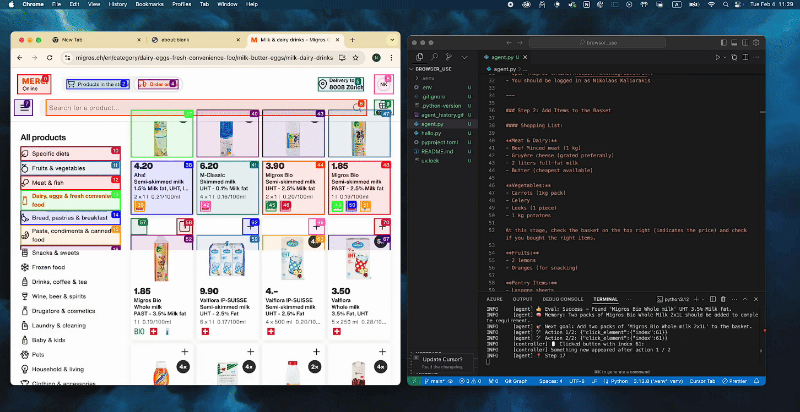

# auto-wing 将AI落地于自动化测试

## AI自动化测试工具回顾

### AppAgent

https://github.com/TencentQQGYLab/AppAgent

AppAgent框架使代理能够通过简化的操作空间来操作智能手机应用程序，模仿类似人类的交互，如点击和滑动。


### cerebellum

https://github.com/theredsix/cerebellum

cerebellum是一个轻量级浏览器代理，通过键盘和鼠标操作在网页上实现用户定义的目标。


### browser-use

https://github.com/browser-use/browser-use

browser-use 让AI代理可以访问网站。




### minscene.js

https://github.com/web-infra-dev/midscene


Midscene.js让AI成为你的浏览器操作员🤖。只要用自然语言描述你想做的事情，它就会帮助你操作网页、验证内容和提取数据。


> min - minimum 最小的； mind 头脑 

## auto-wing 介绍

https://github.com/SeldomQA/auto-wing

auto-wing是一个利用LLM辅助自动化测试的工具, 为你的自动化测试插上翅膀。


### auto-wing 的定位

既然借鉴了minsence.js的思路，为什么不叫minsencepy？因为我希望创建的AI自动化辅助工具和midsence.js有一些差异。

1. 他应该可以方便的应用到现有的自动化项目中。毕竟我们已经编写了大量的自动化项目，可以方便的接入AI是最好的。
2. 他应该支持更多国内的LLM。国内的LLM并不弱了好吧！这两天不是正在被`deepseek-v3`刷屏。方便又便宜对吧！？
3. 他应该支持`playwright`和`selenium`；大部分工具都是基于`playwright`, 然而`selenium`似乎被抛弃了，我来给`selenium`上个呼吸机。


为什么叫 auto-wing? 那当然是给你的自动化测试插上AI的翅膀 🪽，直接原地起飞！

## 特性

⭐ 支持多种操作：`ai_action`、`ai_query`、`ai_assert`。

⭐ 支持多模型：`openai`、`qwen` 和 `deepseek`。

⭐ 支持 `playwright`、`selenium`。

⭐ 方便的和现有自动化项目（`pytest`、`unittest`）集成。

### 安装

```shell
pip install autowing
```

### 设置环境变量

__方法一__

申请LLM需要的key，在项目的根目录下创建`.env`文件。推荐`deepseek`，一是便宜又强大（没错，我就是在蹭蹭DeepSeek）。

* DeepSeek: https://platform.deepseek.com/

```ini
#.env
AUTOWING_MODEL_PROVIDER=deepseek
DEEPSEEK_API_KEY=sk-abdefghijklmnopqrstwvwxyz0123456789
```

__方法二__

> 如果不想使用python-dotenv配置环境变量，可以直接配置环境变量。

```shell
export AUTOWING_MODEL_PROVIDER=deepseek
export DEEPSEEK_API_KEY=sk-abdefghijklmnopqrstwvwxyz0123456789
```

## 使用示例

注： `pytest` 、`unittest` 和 `playwright`、`selenium`可以两两任意组合。

* pytest + playwright 示例

```python
"""
pytest example for Playwright with AI automation.
"""
import pytest
from playwright.sync_api import Page, sync_playwright
from autowing.playwright.fixture import create_fixture

from dotenv import load_dotenv


@pytest.fixture(scope="session")
def page():
    """
    playwright fixture
    """
    # loading .env file
    load_dotenv()
    with sync_playwright() as p:
        browser = p.chromium.launch(headless=False)
        context = browser.new_context()
        page = context.new_page()
        yield page
        context.close()
        browser.close()


@pytest.fixture
def ai(page):
    """
    ai fixture
    """
    ai_fixture = create_fixture()
    return ai_fixture(page)


def test_bing_search(page: Page, ai):
    """
    Test Bing search functionality using AI-driven automation.
    This test demonstrates:
    1. Navigating to Bing
    2. Performing a search
    3. Verifying search results
    """
    page.goto("https://cn.bing.com")

    ai.ai_action('搜索输入框输入"playwright"关键字，并回车')
    page.wait_for_timeout(3000)

    items = ai.ai_query('string[], 搜索结果列表中包含"playwright"相关的标题')
    print("query", items)

    assert len(items) > 1

    print("assert")
    assert ai.ai_assert('检查搜索结果列表第一条标题是否包含"playwright"字符串')
```


* unittest + selenium 示例

```python
"""
Unittest example for Selenium with AI automation.
"""
import unittest
import time
from selenium import webdriver
from autowing.selenium.fixture import create_fixture
from dotenv import load_dotenv


class TestBingSearch(unittest.TestCase):

    @classmethod
    def setUpClass(cls):
        # load .env file
        load_dotenv()
        # Initialize Edge WebDriver
        cls.driver = webdriver.Edge()
        # Create AI fixture
        ai_fixture = create_fixture()
        cls.ai = ai_fixture(cls.driver)

    @classmethod
    def tearDownClass(cls):
        cls.driver.quit()

    def test_01_bing_search(self):
        """
        Test Bing search functionality using AI-driven automation.

        This test demonstrates:
        1. Navigating to Bing
        2. Performing a search
        3. Verifying search results
        """
        self.driver.get("https://cn.bing.com")

        self.ai.ai_action('搜索输入框输入"playwright"关键字，并回车')
        time.sleep(3)

        items = self.ai.ai_query('string[], 搜索结果列表中包含"playwright"相关的标题')
        print("query", items)

        self.assertGreater(len(items), 1)

        self.assertTrue(
            self.ai.ai_assert('检查搜索结果列表第一条标题是否包含"playwright"字符串')
        )


if __name__ == '__main__':
    unittest.main()
```

### 交流

> 欢迎添加微信，交流和反馈问题。

<div style="display: flex;justify-content: space-between;width: 100%">
    <p></p>
</div>
