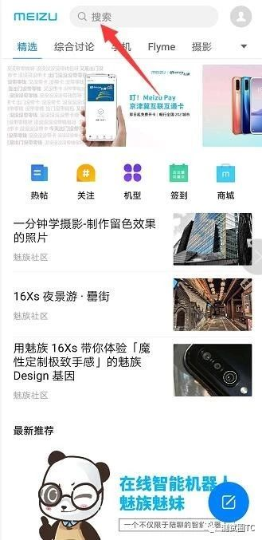

### 我花了两周时间，为了体验appium AI定位元素

当我们在写自动化测试脚本的时候，传统情况下一定要知道元素的属性，如`id`、`name`、`class`等。那么通过AI的方式定位元素可能就不需要知道元素的属性，评价人对元素的判断来定位，比如，看到一个搜索框，直接使用ai:search来定位， 或者我想定位一个关闭按钮，之直接使用 ai:close，我们并不需要知道这搜索框和关闭按钮的属性。

appium 通过插件的方式可以支持AI定位。我相信你已经早就看过相关文章了，可是，你动手体验了么？为体验一个这种定位方式我花了两周时间（其实，主要是上周工作太忙，哈哈！），这里把我的操作过程告诉你。


## 系统要求

首先，需要一些系统依赖项来处理图像。

* macOS

```shell
brew install pkg-config cairo pango libpng jpeg giflib
```

* Linux


```shell
sudo apt-get install pkg-config libcairo2-dev libpango* libpng-dev libjpeg-dev giflib*
```

* Windows

暂不支持。

如果遇到问题，您可能必须单独安装每个包。

我一开始在Windows试了半天不成功，因为我有现成的appium环境，后来发现压根不支持，于是，换成了macOS, 所以后面的操作在macOS下完成，当然，如果你有Linux环境，我觉得也是OK的。

## 安装 Android Studio

因为我要操作的移动设备是Android, 所以需要安装Android SDK, 那么Android Studio集成了Android SDK。

下载android studio：https://developer.android.com/studio

在安装Android Studio的过程中需要设置android SDK的路径，我的路径为:

/Users/tech/Library/Android/sdk
然后，需要配置环境变量：sudo vi ~/.bash_profile

ANDROID_HOME=/Users/tech/Library/Android/sdk
PATH=${PATH}:${ANDROID_HOME}/platform-tools
PATH=${PATH}:${ANDROID_HOME}/tools
最后，使配置生效：source ~/.bash_profile


## 安装appium

1、不要使用appium-desktop, 通过命令方式安装appium。

```shell
brew install node      # get node.js
npm install -g appium  # get appium
```

2、安装appium-doctor

```shell
npm install appium-doctor
```

3、通过appium-doctor命令检查环境：

```shell
appium-doctor

info AppiumDoctor Appium Doctor v.1.11.0
info AppiumDoctor ### Diagnostic for necessary dependencies starting ###
info AppiumDoctor  ✔ The Node.js binary was found at: /usr/local/bin/node
info AppiumDoctor  ✔ Node version is 10.15.1
WARN AppiumDoctor  ✖ Xcode is NOT installed!
info AppiumDoctor  ✔ Xcode Command Line Tools are installed in: /Library/Developer/CommandLineTools
info AppiumDoctor  ✔ DevToolsSecurity is enabled.
info AppiumDoctor  ✔ The Authorization DB is set up properly.
WARN AppiumDoctor  ✖ Carthage was NOT found!
info AppiumDoctor  ✔ HOME is set to: /Users/tech
info AppiumDoctor  ✔ ANDROID_HOME is set to: /Users/tech/Library/Android/sdk
info AppiumDoctor  ✔ JAVA_HOME is set to: /Library/Java/JavaVirtualMachines/jdk-9.0.1.jdk/Contents/Home
info AppiumDoctor  ✔ adb exists at: /Users/tech/Library/Android/sdk/platform-tools/adb
info AppiumDoctor  ✔ android exists at: /Users/tech/Library/Android/sdk/tools/android
info AppiumDoctor  ✔ emulator exists at: /Users/tech/Library/Android/sdk/tools/emulator
info AppiumDoctor  ✔ Bin directory of $JAVA_HOME is set
...
```

* appium AI 插件

GtiHub地址：https://github.com/testdotai/appium-classifier-plugin

使用Appium 1.9.2-beta版以上。另外，一定要使用 XCUITest 驱动程序(用于iOS)或UiAutomator2或Espresso驱动程序(用于Android)。较老的iOS和Android驱动程序不支持所需的Appium在任何情况下，都不推荐使用。


Classifier 设置
要使这个插件对Appium可用，只需转到主appium项目的安装目录下面，并运行:

```shell
cd /usr/local/lib/node_modules/appium
npm install test-ai-classifier
```
将这个插件安装到Appium的依赖树中，并使其可用。

我在安装这个插件的时候各种报错，你可以试试下面的命令。

```
sudo npm --registry http://registry.npm.taobao.org install test-ai-classifier  --unsafe-perm
```

在安装过程发现有依赖google  TensorFlow 的库。


## 使用
1、通过命令的方式启动appium

```shell
appium
[Appium] Welcome to Appium v1.14.0
[Appium] Appium REST http interface listener started on 0.0.0.0:4723
...
```

2、编写自动化测试脚本：

```py
from appium import webdriver
from time import sleep


CAPS = {
    "deviceName": " MEIZU_E3",
    "automationName": "UiAutomator2",
    "platformName": "Android",
    "platformVersion": "7.1.1",
    "appPackage": " com.meizu.flyme.flymebbs",
    "appActivity": ".ui.LoadingActivity",
    "noReset": True,
    "unicodeKeyboard": True,
    "resetKeyboard": True,
    "customFindModules": {"ai": "test-ai-classifier"},
    "testaiConfidenceThreshold": 0.1,
    "shouldUseCompactResponses": False,
}

driver = webdriver.Remote('http://localhost:4723/wd/hub', CAPS)
sleep(3)

# 用 AI 定位到搜索框
driver.find_element_by_custom("ai:search").click()
sleep(5)
driver.find_element_by_id("com.meizu.flyme.flymebbs:id/kf").send_keys("flyme")

driver.find_element_by_id("com.meizu.flyme.flymebbs:id/o7").click()
result = driver.find_elements_by_id("com.meizu.flyme.flymebbs:id/a2a")[0].text
print(result)

driver.quit()
```

* automationName

如果要测试的是Android的话，必须要指为UiAutomator2或 Espresso。

* customFindModules

必须要指定为 {"ai": "test-ai-classifier"}。

* testaiConfidenceThreshold

此功能决定了考虑元素的最低置信度。默认情况下，值为0.2。参数介于0和1之间的数字，其中1表示信心必须完美，0表示根本不需要信任。

* shouldUseCompactResponses

这指示appium在找到元素时包含有关元素的额外信息，这大大加快了获取此插件的输入过程。


最终，我要体验的代码就是这一行：

```
driver.find_element_by_custom("ai:search").click()
```

通过ai来定位搜索框。



确实定位到了，可是定位的速度特别慢，大概需要10~20秒吧！

如果，你想知道 appium-classifier-plugin支持那些类型的元素定位，看这里：https://github.com/testdotai/appium-classifier-plugin/blob/master/lib/labels.js

目前支持100多种类型。